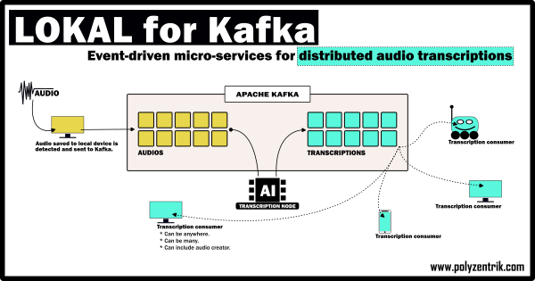

# LOKAL for Kafka
LOKAL for Kafka (LfK). Python + Kafka micro-services solution for distributed audio transcriptions. If the main transcription node can handle transcriptions as fast as audios arrive, things happen in near real time. Else, messages queue.

Here's a quick diagram. 

1. Audio is saved or recorded to a local computer/device LfK folder (manually or programmatically)
2. LfK detects it and transfers it to a computing node/hub, where a transcription is created.
3. Transcription is created at the computing hub. 
4. When the transcription is ready, LfK makes it available to anyone subscribed to the service.

**Please note.** LfK is **NOT** for personal / sporadic usage. If you need just a few transcriptions for yourself or a project, check the original LOKAL instead, an edge-AI app that can help you to easily transcribe audios directly on your computer: https://github.com/jbolns/LOKAL_transcriptions.

## A component for broader ecosystems
LfK is for situations where audios are created across many places and transcriptions are needed elsewhere or across large organisations.

Many potential use cases exist, including – but not limited to – customer service, organisational analytics, multi-location human-machine interactions, and healthcare.

Having said that, LfK is being open-sourced in a generic alpha version to allow integration into broader ecosystems, rather than as a production-ready standalone solution.

## Flexible
LfK has options to pick between three different transcription approaches ([simple](./assets/example_simple_tiny.txt), [segmented](./assets/example_segmentation_tiny.txt), [diarised](./assets/example_diarisation_tiny.txt)) and all five OpenAI Whisper model sizes/qualities available ([tiny](./assets/example_simple_tiny.txt), [base](./assets/example_simple_base.txt), [small](./assets/example_simple_small.txt), [medium](./assets/example_simple_medium.txt), [large](./assets/example_simple_large.txt)). There is also a setting to turn timestamps on and off by default, and a way to opt out from the default.

All options above can be accessed on a transcription-by-transcription basis by:
* Manually dropping audios into the appropriate LfK folder (OK for testing, not recommended otherwise),
* Coding an interface that acts as a producer (recommended – the original LOKAL can be repurposed for this),
* Programatically placing audios into the appropriate LFK folder (also recommended).

## Setup guidance
Setup guidance is available [here](./SETUP_GUIDANCE.md). Please note guidance is intended for developers with knowledge of both Kafka and Python.

Implementation assistance and support is available at a reasonable cost: hello@polyzentrik.com.

## Known limitations
AI is not a magic pill. It has limitations. LfK's limitations include:

**Performance.** All models might incurr signficant errors, especially when overlapping speakers are present and/or speech involves names, places, acronyms, accents, industry-specific terms, or multiple languages. These limitations are considered reasonable. Where humans currently spend too much time on transcriptions at the expense of other more critical tasks, LfK can act as a preliminary tool that reduces the time needed to undertake transcriptions. Where perfect accuracy and precision are not needed, LfK can help increase the amount of information available for analysis. In any case, LfK needs to be implemented responsibly and users must remain in and be given sufficient control of and insight into the process.

**Cyber-security.** LfK is not designed to automatically consider cyber-security risks.

**Context-awareness.** In its generic form, LfK is not designed to consider the specific needs of any given industry.

## License
LfK is released under an Apache 2.0 license. The code is available via GitHub: https://github.com/jbolns/LOKAL_for_Kafka.

## Contribute or support the development of LfK
If you find LfK useful and want it to be maintained, please consider [making a voluntary payment](https://www.polyzentrik.com/help-us-help/).

If you want to contribute differently, perhaps with code or other kind of knowledge-based contributions, the first thing needed is someone who can motivate and manage contributions.