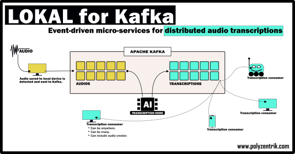

# LOKAL for Kafka
LOKAL for Kafka (LfK) is a Python-Kafka event-driven micro-services solution for distributed audio transcriptions.

Say what!?

Yeah, that's a mouthful.

Here's the summary and a diagram.

When an audio is saved or recorded to a local computer/device LfK folder (which can be done manually or programmatically), LfK automatically detects it and transfers it to a computing node/hub, where a transcription is created. LfK also detects when the transcription is ready and makes it available to anyone subscribed to the service. If the transcription hub can handle transcriptions as fast as audios arrive, all happens in real-time. Otherwise, messages queue and are handled as resources become available.

> *Please note. LfK is **NOT** for sporadic personal usage. If you need transcriptions for yourself, use the original LOKAL instead: https://github.com/jbolns/LOKAL_transcriptions.*

## A component for broader ecosystems
LfK is for situations where the information contained in audio interactions (calls, meetings, conferences, etc.) is valuable, but audios are either created by many users/devices at different times and in different locations *or* the information contained in them is needed by many users/devices at different times and in different locations.

There are many potential use cases, including – but not limited to – customer service, organisational analytics, multi-location human-machine interactions, and healthcare.

Having said that, LfK is being open-sourced in a generic form to allow integration into broader ecosystems.

LfK is, therefore, NOT a 'plug-and-play' solution. There is a lot to configure.

## Setup guidance
Setup guidance is available separately. Click [here](./SETUP_GUIDANCE.md) to access it.

Please note guidance is currently intended for developers with knowledge of both Kafka and Python.

## Known limitations
AI is not a magic pill. It has limitations. LfK's limitations include but are not limited to:

**Performance.** All models might incurr signficant errors, especially when overlapping speakers are present and/or speech involves names, places, acronyms, accents, industry-specific terms, or multiple languages. These limitations are considered reasonable. Where humans currently spend too much time on transcriptions at the expense of other more critical tasks, LfK can act as a preliminary tool that reduces the time needed to undertake transcriptions (provided human oversight and edition are present to ensure accuracy and precision). Where perfect accuracy and precision are not needed, LfK can help increase the amount of information available for analysis (provided analysis acknowledges and manages for the fact that the data corpus LfK or any AI tool can help to generate might contain significant errors). In any case, LfK needs to be implemented responsibly and users must remain in and be given sufficient control of and insight into the process.

**Cyber-security.** LfK is not designed to automatically consider cyber-security risks.

**Context-awareness.** In its generic form, LfK is not designed to consider the specific needs of any given industry. 

## Having troubles?
LfK is a sophisticated solution for a complex problem. Challenges may arise. 

Do get in touch if you feel stuck: hello@polyzentrik.com.

## License
LfK is an open-source product by [polyzentrik.com](https://www.polyzentrik.com/), released under an Apache 2.0 license. The code is available via GitHub: https://github.com/jbolns/LOKAL_for_Kafka.

You are free to use LfK in any way that meets the requirements in the license.

As per the license, LfK comes with no guarantees whatsoever.

## Voluntary payments

If you find LfK useful and want it to be maintained, please consider [making a voluntary payment](https://www.polyzentrik.com/help-us-help/).

Better yet, get in touch for implementation assistance and continued support: hello@polyzentrik.com.